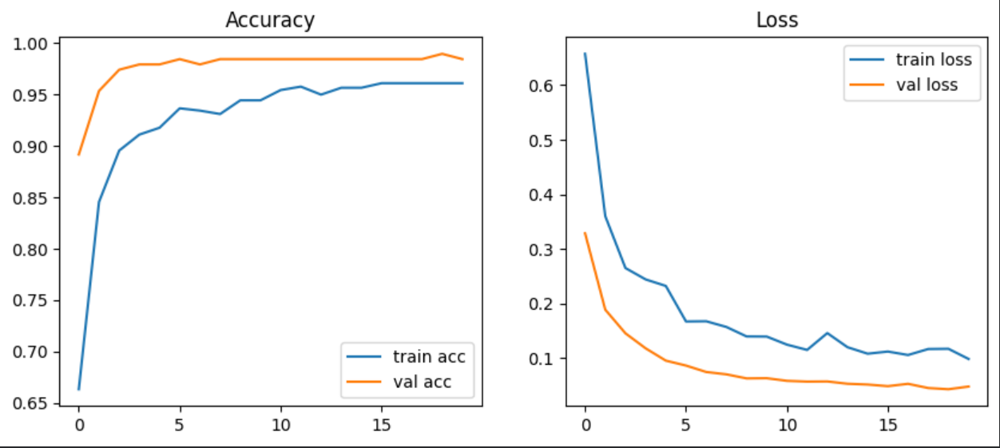
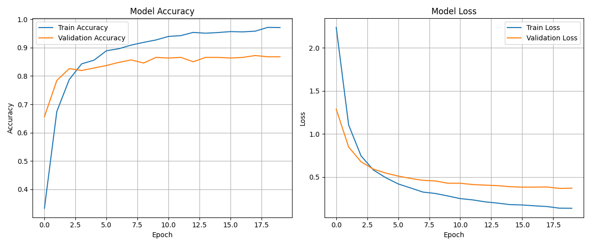
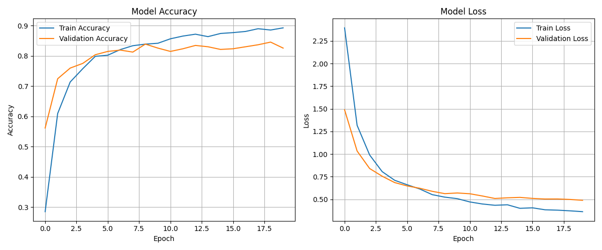
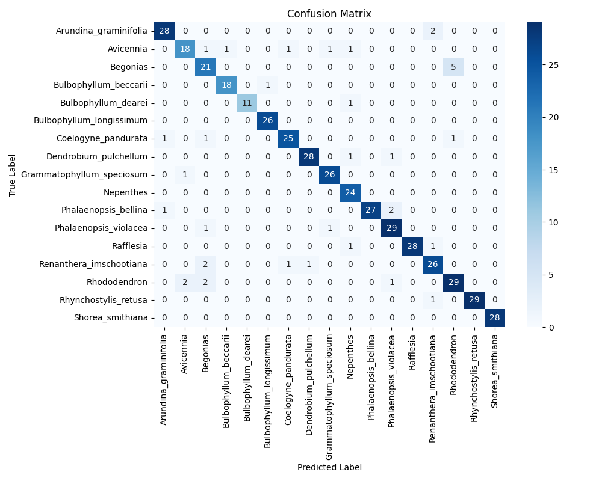
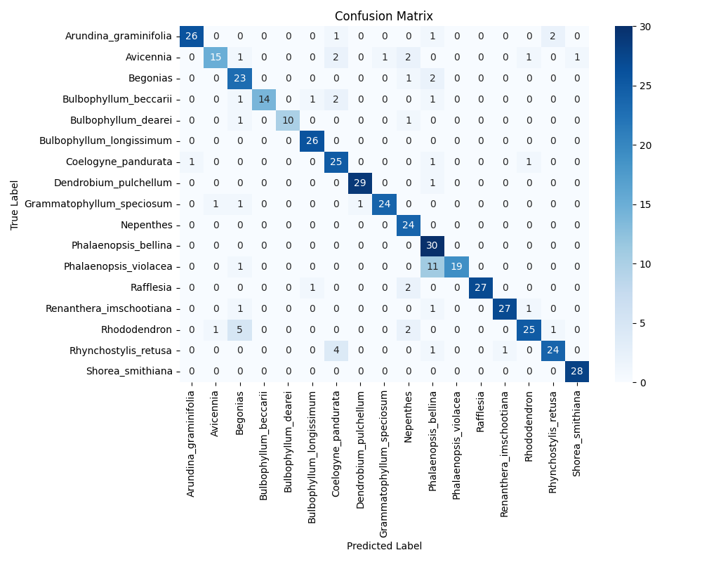
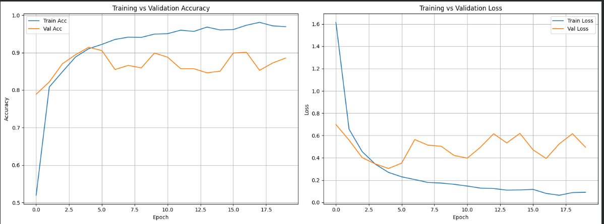

# SmartPlant Sarawak — Computer Vision & Retraining Part

---

## AI Pipeline Demos

| AI Microservice | Demo Video |
| :--- | :---: |
| **1. Plant Species Classification** | [Watch Demo](https://www.youtube.com/shorts/ho49PtWbN0M) |
| **2. Non-Plant Upload Filter** | [Watch Demo](https://www.youtube.com/shorts/ZHPoj2rXJqY) |
| **3. Manual Retraining Pipeline** | [Watch Demo](https://www.youtube.com/watch?v=V3PyQshoA-U) |

---

## Technical Contributions

* Automated web scraping with Selenium via DuckDuckGo and iNaturalist to aggregate, clean, and augment scarce image datasets for endangered Sarawak plant species.
* Built a binary classifier (96.6% accuracy) to filter out non-plant uploads, routing valid images to a fine-tuned MobileNetV2 species classifier with 86.2% test accuracy.
* Served predictions to mobile app via FastAPI endpoint for real-time photo inference and developed a manual retraining pipeline to incorporate expert-verified images.

---

## Model Evaluation & Metrics

### 1. Non-Plant Upload Filter (Binary Classifier)
*Filters out invalid or non-plant images before routing valid photos to the species classifier.*

| Training & Validation Performance | Key Evaluation Metrics |
| :---: | :--- |
|  | • **Test Accuracy:** 96.6%<br>• **Task:** Binary Classification (Plant vs. Non-Plant)<br>• **Purpose:** Eliminates non-plant image noise to protect downstream species inference. |

---

### 2. Initial vs. Augmented Dataset Baseline (MobileNetV2)
*Comparison demonstrating performance gains before and after applying data augmentation.*

| Baseline (Initial Dataset) | Augmented Dataset |
| :---: | :---: |
|  |  |
| **Accuracy & Loss Curves** | **Accuracy & Loss Curves** |
|  |  |
| **Confusion Matrix** | **Confusion Matrix (86.2% Test Accuracy)** |

---

### 3. Retraining Metrics
*Evaluation metrics after feeding expert-verified user images back through the retraining pipeline.*

| Retraining Accuracy & Loss |
| :---: |
|  |

---

> **Note:** The section below contains the complete end-to-end repository documentation (covering Database, API, AI module, and React Native Mobile App setup).

# SmartPlant Sarawak - Complete Documentation

**Version:** 1.0.0  
**Last Updated:** November 21, 2025  

---

## Quick Start

For experienced developers who want to run the application immediately:

**Important:** Before starting, you need to configure IP addresses for:
1. **Frontend** - Update `frontend/app.json` with your backend server IP
2. **Backend** - Configure `backend/.env` with AI server URL (if AI server is on different machine)
3. **AI Server** - Runs on `localhost:5000` by default (change port in `app.py` if needed)

See [Step 5: IP Address Configuration](#step-5-ip-address-configuration) below for detailed instructions.

```bash
# 1. Setup database
cd database/
mysql -u root -p < smartplantctip.sql

# 2. Setup backend
cd ../backend/
npm install
# Create .env file (see Setup Instructions section)
npm start                # Runs on http://localhost:8080

# 3. Setup AI server
cd ../ai/retraining/test/app/
.\venv\Scripts\Activate.ps1  # Windows
# OR
source venv/bin/activate     # Linux/Mac
python app.py               # Runs on http://localhost:5000

# 4. Setup frontend
cd ../../../frontend/
npm install
npx expo start           # Scan QR code with Expo Go app
```

For detailed setup instructions, see [Setup Instructions](#setup-instructions) below.

---

## Table of Contents

1. [Project Overview](#project-overview)
2. [System Architecture](#system-architecture)
3. [Technology Stack](#technology-stack)
4. [Prerequisites & Installation](#prerequisites--installation)
5. [Setup Instructions](#setup-instructions)
6. [Frontend Theme System](#frontend-theme-system)
7. [RESTful API Documentation](#restful-api-documentation)
8. [Image Serving](#image-serving)
9. [Security Features](#security-features)
10. [Database Schema](#database-schema)
11. [Development Workflows](#development-workflows)

---

## Project Overview

SmartPlant Sarawak is a comprehensive mobile application designed for identifying, tracking, and monitoring native plant species in Sarawak, Malaysia. The system integrates AI-powered plant identification, geospatial mapping, community validation, IoT sensor monitoring, and advanced cybersecurity features.

### Key Features

- AI-powered plant species identification for 15 native Sarawak species
- Real-time geolocation tracking and heatmap visualization
- Community-driven validation system for plant identifications
- Multi-factor authentication (MFA) for all users
- Role-based access control with Admin, Expert, and Member roles
- Comprehensive audit logging and security monitoring
- IoT sensor integration for environmental monitoring
- Email verification and password reset workflows
- End-to-end encryption for sensitive data

### Target Species

The system can identify 15 native Sarawak plant species:
1. Arundina graminifolia (Bamboo Orchid)
2. Avicennia (Mangrove)
3. Begonias
4. Bulbophyllum beccarii
5. Bulbophyllum dearei
6. Coelogyne pandurata (Black Orchid)
7. Coelogyne sanderiana
8. Nepenthes (Pitcher Plant)
9. Phalaenopsis bellina
10. Rafflesia (World's Largest Flower)
11. Renanthera imschootiana
12. Rhododendron
13. Rhynchostylis gigantea
14. Rhynchostylis retusa
15. Vanda dearei

---

## System Architecture

This application follows a three-tier architecture pattern:

```
┌─────────────────────────────────────────────────────────────┐
│                      FRONTEND LAYER                         │
│  React Native (Expo) Mobile Application                     │
│  - User Interface (iOS/Android)                             │
│  - Navigation & State Management                            │
└─────────────────┬───────────────────────────────────────────┘
                  │
                  │ HTTP/HTTPS (RESTful API)
                  │
┌─────────────────▼───────────────────────────────────────────┐
│                      BACKEND LAYER                          │
│  Node.js + Express.js Server (Port 8080)                    │
│  - RESTful API Endpoints                                    │
│  - Authentication & Authorization                           │
│  - Business Logic                                           │
│  - Image Storage & Serving                                  │
└─────────────────┬───────────────┬───────────────────────────┘
                  │               │
      ┌───────────┴──────┐       │ HTTP POST
      │                  │       │
      │ MySQL            │       │
      │ Database         │       │
      │                  │       ▼
      └──────────────────┘   ┌──────────────────┐
                             │   AI SERVER      │
                             │  Python/Keras    │
                             │  Port 5000       │
                             └──────────────────┘
```

### Component Communication

- Frontend to Backend: RESTful API calls using axios
- Backend to Database: MySQL connection pool with mysql2
- Backend to AI Server: HTTP POST requests with image data
- Backend to Email Server: SMTP (Gmail) for notifications
- IoT Devices to Backend: Firebase Realtime Database integration

---

## Technology Stack

### Frontend

- Framework: React Native with Expo SDK 54 (~54.0.13)
- Language: TypeScript
- State Management: React Hooks
- Navigation: React Navigation v7 (native-stack v7.3.27, bottom-tabs v7.4.8)
- HTTP Client: Axios for RESTful API communication
- Storage: Expo SecureStore (v15.0.7) for secure token storage
- Maps: React Native Maps (v1.20.1)
- Camera: Expo Camera (v17.0.8)
- Location: Expo Location (v19.0.7)
- UI Components: Custom components with centralized theme system
- Styling: Centralized StyleSheet system (`frontend/src/theme/style.ts`)
- Firebase: Firebase SDK (v12.5.0) for IoT sensor data and alerts

### Backend

- Runtime: Node.js v16.x or higher
- Framework: Express.js v5.1.0
- Language: JavaScript (CommonJS)
- Database: MySQL 8.0 with mysql2 driver (v3.15.1)
- Authentication: JWT (JSON Web Tokens) via jsonwebtoken (v9.0.2)
- Password Hashing: Argon2id (v0.44.0) primary, bcryptjs (v3.0.2) fallback
- Email: Nodemailer (v7.0.7) for SMTP
- File Upload: Multer (v2.0.2) with memory storage for images
- CORS: cors middleware (v2.8.5)
- Environment Variables: dotenv (v17.2.3)
- API Architecture: RESTful API design

### AI/Machine Learning

- Framework: TensorFlow/Keras (TensorFlow 2.16.1)
- Model: MobileNetV2 (Transfer Learning)
- API Server: Flask (Python) - Flask 2.3.0 with Flask-CORS 4.0.0
- Image Processing: PIL (Pillow 10.0.0) for image manipulation and preprocessing
- Data Augmentation: PIL-based augmentation (flips, rotations, brightness/contrast adjustments) and TensorFlow Keras layers
- Model Format: Keras (.keras) - plant_model_v3.keras

### Database

- RDBMS: MySQL 8.0
- Connection Pool: mysql2
- Schema: Normalized relational design
- Encryption: AES-256 for sensitive fields
- Image Storage: BLOB storage for plant and profile images

### Security

- Encryption: AES-256-CBC with multi-version key rotation
- Hashing: Argon2id for passwords
- Authentication: JWT + OTP-based MFA
- Rate Limiting: Account locking after failed attempts
- Audit Logging: Comprehensive event tracking

---

## Prerequisites & Installation

### System Requirements

**Operating Systems:**
- Windows 10/11 (recommended for development)
- macOS 10.15+ (Catalina or newer)
- Linux Ubuntu 20.04+ or equivalent

**Hardware Requirements:**
- CPU: Quad-core processor (Intel i5/AMD Ryzen 5 or better)
- RAM: Minimum 8 GB (16 GB recommended for AI training)
- Storage: 10 GB free space (20 GB recommended with AI training datasets)
- Network: Stable internet connection

### Required Software

#### 1. Node.js & npm

**Version Required:** Node.js v16.x or higher, npm v8.x or higher

**Installation:**
- Windows: Download installer from https://nodejs.org/
- macOS: `brew install node` or download installer
- Linux: `sudo apt install nodejs npm`

**Verify Installation:**
```bash
node --version    # Should show v16.x.x or higher
npm --version     # Should show 8.x.x or higher
```

#### 2. MySQL Database Server

**Version Required:** MySQL 8.0 or higher

**Installation:**
- Windows: Download MySQL Installer from https://dev.mysql.com/downloads/mysql/
- macOS: `brew install mysql` then `brew services start mysql`
- Linux: `sudo apt install mysql-server`

**Verify Installation:**
```bash
mysql --version   # Should show 8.0.x or higher
```

#### 3. Python 3.8+

**Version Required:** Python 3.8 or higher (3.9-3.11 recommended)

**Installation:**
- Windows: Download from https://www.python.org/downloads/ (check "Add to PATH")
- macOS: `brew install python`
- Linux: `sudo apt install python3 python3-pip`

**Verify Installation:**
```bash
python --version     # Should show 3.8.x or higher
pip --version        # Should show pip version
```

#### 4. Expo CLI (Optional)

**Installation:**
```bash
npm install -g expo-cli
```

**Alternative:** Use `npx expo` without global installation

---

## Setup Instructions

### Step 1: Database Setup

```bash
# Navigate to database folder
cd database/

# Import schema directly
mysql -u root -p < smartplantctip.sql

# OR import via MySQL prompt
mysql -u root -p
CREATE DATABASE SmartPlantCTIP;
USE SmartPlantCTIP;
SOURCE smartplantctip.sql;
exit;
```

### Step 2: Backend Setup

```bash
cd backend/

# Install dependencies
npm install

# Create .env file in backend/ directory
# Required environment variables:
NODE_ENV=development
DB_HOST=localhost
DB_USER=root
DB_PASSWORD=your_password
DB_PORT=3306
DB_NAME=SmartPlantCTIP
PORT=8080
JWT_SECRET=your_jwt_secret
JWT_EXPIRES_IN=3600

# Email Configuration (Gmail)
EMAIL_MODE=smtp
EMAIL_USER=your_email@gmail.com
EMAIL_PASS=your_app_password

# Encryption Keys
SECRET_KEY_V1=your_key_1
SECRET_KEY_V2=your_key_2
SECRET_KEY_V3=your_key_3
SECRET_KEY_CURRENT=V2

# Start server
npm start

# OR development mode with auto-reload
npm run dev
```

### Step 3: AI Server Setup

```bash
# Navigate to AI folder
cd ai/retraining/test/app/

# Activate virtual environment (Windows)
.\venv\Scripts\Activate.ps1

# Activate virtual environment (Linux/Mac)
source venv/bin/activate

# Start AI server
python app.py

# Server runs on localhost:5000
```

### Step 4: Frontend Setup

```bash
cd frontend/

# Install dependencies
npm install

# Update API base URL in app.json
# Set EXPO_PUBLIC_API_BASE_URL to your computer's IP address
# Example: http://192.168.1.47:8080

# Start Expo development server
npx expo start

# Options:
# - Press 'a' for Android emulator
# - Press 'i' for iOS simulator
# - Scan QR code with Expo Go app
```

### Step 5: IP Address Configuration

**Important:** Your mobile app needs to connect to your backend server, and your backend needs to connect to the AI server. Update the IP addresses in the following locations:

#### Frontend IP Configuration

The frontend mobile app needs to know where your backend server is running.

**File to Edit:** `frontend/app.json`

**Location:** Look for the `extra` section at the bottom of the file:

```json
{
  "expo": {
    ...
    "extra": {
      "EXPO_PUBLIC_API_BASE_URL": "http://192.168.1.47:8080"
    }
  }
}
```

**What to Change:**
- Replace `192.168.1.47` with your computer's local IP address
- Keep the port `:8080` (unless you changed the backend port)
- Example: `http://192.168.1.104:8080`

**Alternative Location 1:** `frontend/src/services/ApiService.ts` (line 74)
- This file contains `DEFAULT_API_BASE_URL = 'http://192.168.1.47:8080'`
- This is used as a fallback if `EXPO_PUBLIC_API_BASE_URL` is not set in `app.json`
- **Note:** `app.json` takes precedence over this value, so update `app.json` first
- If you want to change the default fallback, edit line 74 in `ApiService.ts`:
  ```typescript
  const DEFAULT_API_BASE_URL = 'http://YOUR_IP:8080';  // change to your local IP!
  ```

#### Backend IP Configuration

The backend server runs on your computer and listens on a specific port. The IP address is automatically determined by your computer's network interface.

**File to Edit:** `backend/.env`

**What to Configure:**
- `PORT=8080` - The port the backend server listens on (default: 8080)
- The IP address is automatically your computer's local IP (no manual setting needed)

**To Find Your Computer's IP Address:**
- **Windows:** Run `ipconfig` in Command Prompt and look for "IPv4 Address" under your active network adapter
- **macOS/Linux:** Run `ifconfig` in Terminal and look for "inet" address (usually under `en0` or `eth0`)
- The backend server will also display your IP when it starts: `Mobile devices can connect at: http://YOUR_IP:8080`

**Note:** If you're running the backend on a different machine, use that machine's IP address in the frontend configuration.

**Backend Server Display IP (Optional):** `backend/server.js` (line 236)
- The server console message shows a hardcoded IP in the startup log
- This is just for display purposes and doesn't affect functionality
- To update the displayed IP, edit line 236 in `server.js`:
  ```javascript
  console.log(` Mobile devices can connect at: http://YOUR_IP:${PORT}`);
  ```
- **Note:** This is cosmetic only - the server actually listens on `0.0.0.0` (all interfaces) and will work with any IP

#### AI Server IP Configuration

The backend needs to know where the AI server (Python Flask) is running.

**File to Edit:** `backend/.env`

**What to Add:**
```env
AI_SERVER_URL=http://localhost:5000
```

**Configuration Options:**
- **Same Machine (Default):** Use `http://localhost:5000` (AI server runs on the same computer as backend)
- **Different Machine:** Use `http://AI_SERVER_IP:5000` (replace with the AI server machine's IP address)
- **Example:** `http://192.168.1.105:5000` (if AI server is on a different computer)

**AI Server Port:** The AI server (Flask) runs on port 5000 by default. To change it, edit `ai/retraining/test/app/app.py` and modify the `app.run()` call at the bottom of the file:

```python
if __name__ == '__main__':
    app.run(host='0.0.0.0', port=5000, debug=True)  # Change port here if needed
```

#### Summary of IP Configuration Locations

| Component | File to Edit | What to Change | Priority |
|-----------|--------------|----------------|----------|
| **Frontend (Primary)** | `frontend/app.json` | `EXPO_PUBLIC_API_BASE_URL` - Set to your backend IP:port | **High** - Takes precedence |
| **Frontend (Fallback)** | `frontend/src/services/ApiService.ts` (line 74) | `DEFAULT_API_BASE_URL` - Fallback if app.json not set | Medium - Only used if app.json missing |
| **Backend Port** | `backend/.env` | `PORT=8080` - Change if needed (default: 8080) | High - Required |
| **Backend Display IP** | `backend/server.js` (line 236) | Console log message IP (cosmetic only) | Low - Optional, display only |
| **AI Server URL** | `backend/.env` | `AI_SERVER_URL=http://localhost:5000` - Set to AI server location | High - Required if AI on different machine |
| **AI Server Port** | `ai/retraining/test/app/app.py` | `port=5000` in `app.run()` - Change if needed | Medium - Only if changing port |

#### Testing Connectivity

1. **Test Backend Server:**
   - Start backend: `cd backend && npm start`
   - Open browser on your phone (same WiFi) and visit: `http://YOUR_IP:8080`
   - You should see a server response or health check message

2. **Test AI Server:**
   - Start AI server: `cd ai/retraining/test/app && python app.py`
   - Open browser and visit: `http://localhost:5000/health`
   - You should see a health check response

3. **Test Frontend Connection:**
   - Start frontend: `cd frontend && npx expo start`
   - Try logging in or making an API call
   - Check Expo console for connection errors

---

## Frontend Theme System

The frontend uses a centralized styling system located at `frontend/src/theme/style.ts`. All screen and component styles are defined in this single file, along with reusable style constants (theme variables) used throughout the application.

### Architecture

The theme system follows a centralized approach:
- All styles are defined in `frontend/src/theme/style.ts`
- Style constants (colors, spacing, typography, etc.) are exported as reusable values
- Screen-specific styles are organized as named StyleSheet exports (e.g., `homeScreenStyles`, `loginScreenStyles`)
- Component-specific styles are organized as named StyleSheet exports (e.g., `buttonStyles`, `inputStyles`)
- Admin styles are separated from user-facing styles for clarity

### Style Constants (Theme Variables)

The theme system provides the following constants:

**Colors**
- Primary colors: `primary`, `primaryDark`, `primaryLight` (green theme)
- Secondary colors: `secondary`, `accent`
- Neutral colors: `white`, `black`, `gray`, `lightGray`, `darkGray`
- Status colors: `success`, `warning`, `error`, `info`
- Text colors: `textPrimary`, `textSecondary`, `textLight`, `textMuted`
- Background colors: `background`, `surface`, `cardBackground`

**Spacing Scale**
- `xs`: 4px (extra small)
- `sm`: 8px (small)
- `md`: 16px (medium - default)
- `lg`: 24px (large)
- `xl`: 32px (extra large)
- `xxl`: 48px (extra extra large)

**Typography**
- Font sizes: `xs` (13px), `sm` (15px), `md` (17px), `lg` (19px), `xl` (22px), `xxl` (26px), `xxxl` (34px)
- Font weights: `normal` (400), `medium` (500), `semibold` (600), `bold` (700), `extrabold` (800)
- Line heights: `tight` (1.3), `normal` (1.5), `relaxed` (1.7)

**Border Radius**
- `sm`: 4px
- `md`: 8px (standard)
- `lg`: 12px
- `xl`: 16px
- `full`: 9999px (pills, circles)

**Shadows (Platform-specific)**
- `sm`: Small shadow (elevation 2)
- `md`: Medium shadow (elevation 4)
- `lg`: Large shadow (elevation 8)

**Layout Constants**
- `screenPadding`: 16px (default screen padding)
- `headerHeight`: 60px
- `tabBarHeight`: 60px
- `buttonHeight`: 48px
- `inputHeight`: 48px
- `cardPadding`: 16px

### Using the Theme System

**Importing Style Constants**

```typescript
import { colors, spacing, typography, borderRadius, shadows, layout } from '../theme/style';
```

**Importing Screen Styles**

```typescript
import { homeScreenStyles, loginScreenStyles } from '../theme/style';

// Usage in component
<View style={homeScreenStyles.container}>
  <Text style={homeScreenStyles.title}>Hello</Text>
</View>
```

**Importing Component Styles**

```typescript
import { buttonStyles, inputStyles } from '../theme/style';

// Usage in component
<TouchableOpacity style={buttonStyles.primaryButton}>
  <Text style={buttonStyles.primaryButtonText}>Click Me</Text>
</TouchableOpacity>
```

### Available Screen Styles

All screen styles follow the naming pattern `[screenName]ScreenStyles`:
- `homeScreenStyles` - Home/Dashboard screen
- `speciesScreenStyles` - Species catalog screen
- `landingScreenStyles` - Landing/introduction screen
- `loadingScreenStyles` - Loading screen
- `loginScreenStyles` - Login screen
- `splashScreenStyles` - Splash screen
- `mfaOtpScreenStyles` - MFA OTP verification screen
- `profileScreenStyles` - User profile screen
- `forgotPasswordScreenStyles` - Password reset screen
- `authSelectionScreenStyles` - Authentication selection screen
- `registerScreenStyles` - User registration screen
- `resetPasswordScreenStyles` - Password reset confirmation screen
- `parkListScreenStyles` - Park listing screen
- `parkDetailModalStyles` - Park detail modal
- `myHistoryScreenStyles` - User history screen
- `mapScreenStyles` - Map screen
- `identifyPlantScreenStyles` - Plant identification screen
- `identificationResultScreenStyles` - Identification results screen
- `adminDashboardScreenStyles` - Admin dashboard screen
- `accountMonitoringDashboardStyles` - Account monitoring screen
- `activityFeedStyles` - Activity feed screen
- `adminValidationReviewScreenStyles` - Admin validation review screen
- `historicalDataScreenStyles` - Historical data screen
- `iotDashboardScreenStyles` - IoT dashboard screen
- `recentAlertStyles` - Recent alert component styles
- `userRoleManagementStyles` - User role management screen

### Available Component Styles

All component styles follow the naming pattern `[componentName]Styles`:
- `buttonStyles` - Button component styles
- `cardStyles` - Card component styles
- `cardPlantStyles` - Plant card component styles
- `inputStyles` - Input/TextInput component styles
- `headerStyles` - Header component styles
- `containerStyles` - Container component styles
- `filterStyles` - Filter component styles
- `heatmapStyles` - Heatmap component styles
- `heatmapButtonStyles` - Heatmap button styles
- `heatmapSettingsButtonStyles` - Heatmap settings button styles
- `heatmapSettingsViewStyles` - Heatmap settings view styles
- `mapViewContainerStyles` - Map view container styles
- `adminMapViewContainerStyles` - Admin map view container styles
- `adminToolsStyles` - Admin tools component styles
- `alertPopupStyles` - Alert popup component styles
- `authContextStyles` - Auth context modal styles
- `chatbotStyles` - Chatbot component styles
- `imageUploadErrorModalStyles` - Image upload error modal styles
- `incorrectIdentificationModalStyles` - Incorrect identification modal styles
- `locationButtonStyles` - Location button styles
- `safeImageStyles` - Safe image component styles
- `temporalSliderStyles` - Temporal slider component styles
- `userArrowStyles` - User arrow component styles
- `viewAlertStyles` - View alert component styles
- `appNavigatorStyles` - App navigator styles

### Admin Styles

Admin-specific styles are defined separately and include:
- `adminColors` - Admin color palette
- `styledStyles` - Styled container styles for admin screens
- `commonStyles` - Common admin screen styles (tables, headers, etc.)
- `iotDashboardStyles` - IoT dashboard styles
- `reviewHistoricalStyles` - Historical data review styles
- `monitorLiveStyles` - Live monitoring styles
- `deviceManagementStyles` - Device management styles

### Benefits of Centralized Styling

1. **Consistency**: All styles use the same constants, ensuring visual consistency across the application
2. **Maintainability**: Update colors, spacing, or typography in one place affects the entire application
3. **Reusability**: Style constants can be shared across components and screens
4. **Performance**: StyleSheet.create() is optimized for performance in React Native
5. **Type Safety**: TypeScript support for all style definitions provides compile-time type checking
6. **Organization**: All styles in one location makes it easy to find and update styles

### File Structure

```
frontend/src/theme/
  └── style.ts          # All styles and style constants
```

**Note**: Previously, styles were split across multiple files (`index.ts`, `adminstyle.ts`, `styles.ts`). These have been consolidated into a single `style.ts` file for better organization and maintainability.

---

## RESTful API Documentation

This application uses a RESTful API architecture. All communication between the frontend and backend follows REST principles using standard HTTP methods (GET, POST, PUT, DELETE).

### Base URL

```
http://localhost:8080
```

For mobile devices on the same network:
```
http://YOUR_IP_ADDRESS:8080
```

### Authentication

All authenticated endpoints require a JWT token in the Authorization header:
```
Authorization: Bearer YOUR_JWT_TOKEN
```

### API Endpoints

#### Authentication Endpoints

**POST /auth/register**
- Description: Create a new user account
- Body: `{ Username, EmailAddress, Password }`
- Response: `{ success, message, userId }`
- Authentication: None

**POST /auth/signin**
- Description: User login (triggers MFA for all users)
- Body: `{ Identifier, Password }`
- Response: `{ success, requiresMFA, userId, email }`
- Authentication: None

**POST /auth/logout**
- Description: User logout
- Body: None
- Response: `{ success, message }`
- Authentication: None

**POST /auth/requestReset**
- Description: Request password reset
- Body: `{ email }`
- Response: `{ success, userId }`
- Authentication: None

**POST /auth/resetPassword**
- Description: Complete password reset
- Body: `{ userId, newPassword }`
- Response: `{ success, message }`
- Authentication: None

**PUT /auth/update-profile**
- Description: Update user profile information
- Body: `{ username, emailAddress }`
- Response: `{ success, message }`
- Authentication: Required

#### OTP Endpoints

**POST /otp/generate**
- Description: Generate OTP code (for MFA or password reset)
- Body: `{ userId, purpose }`
- Response: `{ success, message }`
- Authentication: None

**POST /otp/verify**
- Description: Verify OTP code
- Body: `{ userId, otp, purpose }`
- Response: `{ success, token }` (for MFA) or `{ success, message }` (for other purposes)
- Authentication: None

#### Plant Identification Endpoints

**GET /plant**
- Description: Get all plant markers with optional filters
- Query Parameters: `species`, `commonName`, `search`, `status`, `date`, `includeAll`, `conservation`
- Response: `{ markers: [...] }`
- Authentication: Optional (public sees only approved markers; admins can see all)

**GET /plant/species/all**
- Description: Get all plant species catalog
- Response: `{ species: [...] }`
- Authentication: None

**GET /plant/species/speciesImage**
- Description: Get species with associated images
- Response: `{ success, count, data: [...] }`
- Authentication: None

**POST /plant/identify**
- Description: AI plant identification
- Body: `{ image: string (base64 encoded), latitude?: number, longitude?: number }`
- Response: `{ success: true, data: { species, confidence, imageUrl, predictionId, alternatives: [...] } }`
- Authentication: Required

**POST /plant/upload**
- Description: Upload plant image
- Body: FormData with `plantImage` file and optional `longitude`, `latitude`
- Response: `{ success, data: { plantImageId, imageUrl, size } }`
- Authentication: Required

**GET /plant/my-images**
- Description: Get authenticated user's plant images
- Response: `{ images: [...] }`
- Authentication: Required

**GET /plant/image/:imageId**
- Description: Get specific plant image by ID (returns image BLOB)
- Response: Image binary data
- Authentication: None

**GET /plant/validations/user/:userId**
- Description: Get user's validation history
- Response: `{ validations: [...] }`
- Authentication: Required

**GET /plant/identifications/user/:userId**
- Description: Get user's identification history
- Response: `{ identifications: [...] }`
- Authentication: Required

**PUT /plant/:markerId**
- Description: Update plant marker (Admin or Expert only)
- Body: `{ identification_status, ... }`
- Response: `{ success, message }`
- Authentication: Required (Admin or Expert role)

**PUT /plant/marker/:markerId/coords**
- Description: Update marker coordinates (Admin only)
- Body: `{ latitude, longitude }`
- Response: `{ success, message }`
- Authentication: Required (Admin role)

**DELETE /plant/marker/:markerId**
- Description: Delete plant marker (Admin only)
- Response: `{ success, message }`
- Authentication: Required (Admin role)

#### Community Validation Endpoints

**GET /community-validation/pending**
- Description: Get pending identifications that need validation
- Response: `{ pendingValidations: [...] }`
- Authentication: None

**POST /community-validation/member-verify**
- Description: Submit member verification for a prediction
- Body: `{ predictionId, verificationType, ... }`
- Response: `{ success, message }`
- Authentication: Required

**POST /community-validation/validate**
- Description: Submit validation vote (confirm or reject)
- Body: `{ predictionId, validationType, ... }`
- Response: `{ success, message }`
- Authentication: Required

**POST /community-validation/save-feedback**
- Description: Save feedback form (text and suggested species)
- Body: `{ predictionId, feedback, ... }`
- Response: `{ success, message }`
- Authentication: Required

**POST /community-validation/submit**
- Description: Submit full prediction feedback (for incorrect identification flow)
- Body: `{ predictionId, feedback, ... }`
- Response: `{ success, message }`
- Authentication: Required

**POST /community-validation/admin-override**
- Description: Admin override validation status (Admin only)
- Body: `{ predictionId, status, ... }`
- Response: `{ success, message }`
- Authentication: Required (Admin role)

#### User Management Endpoints

**GET /user/:userId/profile**
- Description: Get user profile
- Response: `{ user: {...} }`
- Authentication: None

**PUT /user/:userId/profile**
- Description: Update user profile
- Body: `{ firstName, lastName, ... }`
- Response: `{ success, message }`
- Authentication: Required (own profile only)

**GET /user/:userId/stats**
- Description: Get user statistics
- Response: `{ stats: {...} }`
- Authentication: None

**GET /user/:userId/history**
- Description: Get user history (identifications + validations)
- Response: `{ history: [...] }`
- Authentication: None

**POST /user/upload-profile-image**
- Description: Upload user profile image
- Body: FormData with `profileImage` file
- Response: `{ success, data: { imageUrl, ... } }`
- Authentication: Required

**GET /user/profile-image/:userId**
- Description: Get user profile image (returns image BLOB)
- Response: Image binary data
- Authentication: None

#### Image Endpoints

**GET /image/:id**
- Description: Get plant image by ID from plant_images table (returns image BLOB)
- Response: Image binary data
- Authentication: None

**GET /image/classification/:species**
- Description: Get species reference image from plant_classifications table
- Response: Image binary data
- Authentication: None

#### Heatmap Endpoints

**GET /heatmap**
- Description: Get heatmap data points
- Query Parameters: Optional time and bounds filters
- Response: `[{ lng, lat, sighted_date, count }, ...]`
- Authentication: None

**GET /heatmap/locations**
- Description: Get location data with filters
- Query Parameters: `species`, `minConfidence`, `maxConfidence`, `verified`, `limit`, `bounds`
- Response: `{ locations: [...] }`
- Authentication: None

#### Admin Endpoints

**GET /audit/logs**
- Description: Get audit logs (Admin only)
- Query Parameters: `userId`, `eventType`, `startDate`, `endDate`
- Response: `{ logs: [...] }`
- Authentication: Required (Admin role)

**GET /audit/metrics**
- Description: Get dashboard metrics (Admin only)
- Response: `{ metrics: {...} }`
- Authentication: Required (Admin role)

**GET /audit/activities**
- Description: Get activity feed (Admin only)
- Response: `{ activities: [...] }`
- Authentication: Required (Admin role)

**GET /audit/alerts**
- Description: Get security alerts (Admin only)
- Response: `{ alerts: [...] }`
- Authentication: Required (Admin role)

**GET /role/users**
- Description: Get all users with roles (Admin only)
- Response: `{ users: [...] }`
- Authentication: Required (Admin role)

**PUT /role/update**
- Description: Update user role (Admin only)
- Body: `{ userId, newRole }`
- Response: `{ success, message }`
- Authentication: Required (Admin role)

#### General Endpoints

**GET /**
- Description: Health check
- Response: `"Server running successfully"`
- Authentication: None

**GET /health**
- Description: API health check
- Response: `{ success: true, status: "ok" }`
- Authentication: None

---

## Image Serving

The application serves images in two ways: from database BLOBs and from static file directories.

### Plant Images

Plant images are stored as BLOBs in the `plant_images` table and served via RESTful API endpoints.

**How to Access Plant Images:**

1. **By Plant Image ID**
   - Endpoint: `GET /image/:id`
   - Example: `http://localhost:8080/image/123`
   - Returns: Image binary data with proper MIME type headers
   - Authentication: Not required

2. **By Plant Image ID (Alternative Route)**
   - Endpoint: `GET /plant/image/:imageId`
   - Example: `http://localhost:8080/plant/image/123`
   - Returns: Image binary data with proper MIME type headers
   - Authentication: Not required

**Finding Plant Image IDs:**

You can find plant image IDs from:
- Database query: `SELECT plant_image_id FROM plant_images LIMIT 10;`
- API response from `/plant/species/speciesImage` - includes `imageId` in each image object
- API response from `/user/:userId/history` - includes `plant_image_id` in identification objects

**Database Storage:**

Plant images are stored in the `plant_images` table:
- Column: `image_data` (BLOB)
- Column: `mime_type` (varchar) - e.g., "image/jpeg", "image/png"
- Column: `image_size` (int) - size in bytes

**Image Upload:**

When uploading a plant image via `POST /plant/upload`, the image is stored in memory (using Multer memoryStorage) and then saved as a BLOB in the database. The route returns an `imageUrl` like `/plant/image/${plantImageId}` that can be used to access the image.

### Profile Images

Profile images are stored as BLOBs in the `users` table and served via a dedicated endpoint.

**How to Access Profile Images:**

1. **By User ID**
   - Endpoint: `GET /user/profile-image/:userId`
   - Example: `http://localhost:8080/user/profile-image/1`
   - Returns: Image binary data with proper MIME type headers
   - Authentication: Not required

**Finding User IDs:**

You can find user IDs from:
- Database query: `SELECT user_id, username FROM users WHERE profile_image_data IS NOT NULL;`
- API response from `/user/:userId/profile` - includes user information
- Login response - includes `userId` in the response

**Database Storage:**

Profile images are stored in the `users` table:
- Column: `profile_image_data` (BLOB)
- Column: `profile_mime_type` (varchar) - e.g., "image/jpeg", "image/png"
- Column: `profile_image_size` (int) - size in bytes

**Image Upload:**

When uploading a profile image via `POST /user/upload-profile-image`, the image is stored in memory (using Multer memoryStorage) and then saved as a BLOB in the database. The route returns an `imageUrl` like `/user/profile-image/${userId}` that can be used to access the image.

### Species Reference Images

Species reference images are stored as BLOBs in the `plant_classifications` table.

**How to Access Species Reference Images:**

1. **By Species Name**
   - Endpoint: `GET /image/classification/:species`
   - Example: `http://localhost:8080/image/classification/Rafflesia`
   - Returns: Image binary data with proper MIME type headers
   - Authentication: Not required

**Database Storage:**

Species reference images are stored in the `plant_classifications` table:
- Column: `image_ref` (BLOB)
- Column: `mime_type` (varchar)

### Static File Serving

The backend also serves static files from the `uploads` directory and AI dataset directory.

**Static File Routes:**

1. **Uploaded Files**
   - Route: `GET /uploads/*`
   - Path: Files in `backend/uploads/` directory
   - Example: `http://localhost:8080/uploads/plants/Rafflesia/image.jpg`

2. **AI Training Dataset**
   - Route: `GET /ai-images/*`
   - Path: Files in `ai/retraining/test/dataset_split/train/` directory
   - Example: `http://localhost:8080/ai-images/Rafflesia/Rafflesia_0.jpg`

**Note:** Most images in this application are stored as BLOBs in the database rather than as static files. The static file serving is mainly for legacy files or AI training dataset access.

### Testing Images in Browser

To test image access:

1. **Start the backend server:**
```bash
cd backend/
   npm start
   ```

2. **Find an image ID from the database:**
   ```sql
   SELECT plant_image_id FROM plant_images LIMIT 1;
   -- Or
   SELECT user_id FROM users WHERE profile_image_data IS NOT NULL LIMIT 1;
   ```

3. **Open in browser:**
   - For plant images: `http://localhost:8080/image/123` (replace 123 with actual ID)
   - For profile images: `http://localhost:8080/user/profile-image/1` (replace 1 with actual user ID)

4. **Verify:**
   - If image exists: Image will display in browser
   - If image doesn't exist: You'll see "Image not found" (404 error)

### Image Storage Architecture

The application uses BLOB storage for images, which means:
- Images are stored directly in the database as binary data
- No file system folders needed for image storage
- Images are accessed via RESTful API endpoints
- Proper MIME type headers ensure correct display
- All image endpoints return binary data that browsers can display directly

**Advantages of BLOB Storage:**
- Centralized storage in database
- Easier backup and restore
- No file system path management
- Database-level security and access control
- Consistent with application architecture

---

## Security Features

### Authentication Layers

1. **Email Verification**: Required before first login
2. **Password Policy**: Strong password requirements (8-22 chars, uppercase, lowercase, digit, special char)
3. **Multi-Factor Authentication**: OTP sent to email (90-second expiry) for all users
4. **JWT Tokens**: Signed, time-limited access tokens
5. **Secure Storage**: Expo SecureStore for token storage on mobile devices

### Password Security

- Hashing Algorithm: Argon2id (primary), bcrypt (fallback)
- Salt: Unique per password
- Parameters: Memory cost 65536 KiB, Time cost 3, Parallelism 4
- Reset Workflow: OTP-based password reset

### Account Protection

- Login Attempts: Tracked per user
- Account Locking: After 5 failed attempts
- Lock Duration: 3 hours (auto-unlock)
- Manual Unlock: Admin can unlock via CLI tool

### Data Encryption

- Algorithm: AES-256-CBC
- Key Management: Multi-version key rotation
- Encrypted Fields: Email, sensitive user data
- Key Storage: Environment variables

### Audit Logging

Events logged include:
  - Login success/failure
  - Registration
  - Email verification
  - Password reset
  - Role changes
  - Data access
  - Configuration changes

Log fields: User ID, event type, timestamp, IP address, details

### Rate Limiting

- OTP Generation: 90-second cooldown
- Email Sending: Prevented spam
- Login Attempts: Tracked and limited

---

## Database Schema

The database consists of 11 main tables organized as follows:

1. **users** - User accounts with encrypted credentials, profile images (BLOB), and authentication settings
2. **plant_classifications** - Species data and reference images for the 15 native Sarawak plant species
3. **plant_images** - Plant images stored as BLOBs with metadata (size, MIME type, location, upload datetime)
4. **ai_predictions** - AI identification results linking images to species classifications with confidence scores
5. **prediction_feedback** - User feedback on predictions (Verified, Rejected, or Pending)
6. **plant_markers** - Geospatial plant markers with location data and identification status
7. **otp_codes** - OTP storage with expiration for MFA, email verification, and password resets
8. **login_attempts** - Failed login tracking for account security
9. **audit_logs** - Comprehensive audit trail for all system events and security monitoring
10. **model_registry** - AI model version tracking and training metadata
11. **dataset_registry** - Dataset version tracking for AI training data

**Database File:** `database/smartplantctip.sql`

**Image Storage:** All images (plant images and profile images) are stored as BLOBs directly in the database rather than as files on the file system. This provides centralized storage, easier backup, and consistent access via RESTful API endpoints.

---

## Frontend API Service

The frontend uses a centralized API service located at `frontend/src/services/ApiService.ts`. This service acts as a wrapper around all backend RESTful API calls, providing type-safe methods and automatic token management.

### Architecture

- Singleton Pattern: Single instance shared across the entire application
- Automatic Token Injection: JWT tokens automatically added to authenticated requests
- Type Safety: TypeScript interfaces for all requests and responses
- Error Handling: Consistent error handling across all API calls
- Timeout Protection: 15-second timeout prevents hanging requests
- Platform Support: Automatic Android emulator localhost mapping (10.0.2.2)

### Base Configuration

- Default Base URL: `http://192.168.1.47:8080` (configurable in `ApiService.ts` or `app.json`)
- Timeout: 15 seconds per request
- Token Storage: Expo SecureStore (encrypted on device)
- Response Format: All methods return `ApiResponse<T>` with `success`, `data`, `message`, and `error` fields

### Frontend API Methods

#### Authentication Methods

**login(credentials: LoginRequest)**
- Frontend Method: `apiService.login({ identifier: string, password: string })`
- Backend Endpoint: `POST /auth/signin`
- Request Body: `{ Identifier: string, Password: string }`
- Response: `ApiResponse<AuthResponse>` with `requiresMFA`, `userId`, `email`
- Usage: User login that triggers MFA for all users

**register(userData: RegisterRequest)**
- Frontend Method: `apiService.register({ username: string, email: string, password: string })`
- Backend Endpoint: `POST /auth/register`
- Request Body: `{ Username: string, EmailAddress: string, Password: string }`
- Response: `ApiResponse<AuthResponse>` with `userId`, `message`
- Usage: Create new user account (email verification required)

**logout()**
- Frontend Method: `apiService.logout()`
- Backend Endpoint: `POST /auth/logout`
- Response: `ApiResponse`
- Usage: User logout (token removed from SecureStore)

**requestReset(email: string)**
- Frontend Method: `apiService.requestReset(email: string)`
- Backend Endpoint: `POST /auth/requestReset`
- Request Body: `{ email: string }`
- Response: `ApiResponse<{ userId: number, username: string, email: string }>`
- Usage: Request password reset OTP

**resetPassword(request: ResetPasswordRequest)**
- Frontend Method: `apiService.resetPassword({ email, otp?, newPassword? })`
- Backend Endpoint: `POST /auth/resetPassword`
- Request Body: `{ email: string, otp?: string, newPassword?: string }`
- Response: `ApiResponse`
- Usage: Complete password reset with OTP verification

**generateOtp(request: { userId: number, email: string })**
- Frontend Method: `apiService.generateOtp({ userId, email })`
- Backend Endpoint: `POST /otp/generate`
- Request Body: `{ userId: number, email: string }`
- Response: `ApiResponse` with `message`, `expiresAt`
- Usage: Generate OTP for MFA or password reset

**verifyOtp(request: { userId: number, otp: string, purpose?: string })**
- Frontend Method: `apiService.verifyOtp({ userId, otp, purpose? })`
- Backend Endpoint: `POST /otp/verify`
- Request Body: `{ userId: number, otp: string, purpose?: 'mfa' | 'verification' | 'reset' }`
- Response: `ApiResponse<{ token: string }>` (for MFA) or `ApiResponse` (for other purposes)
- Usage: Verify OTP code for MFA, email verification, or password reset

**updateUserProfile(userId: string, profileData)**
- Frontend Method: `apiService.updateUserProfile(userId, { username, emailAddress })`
- Backend Endpoint: `PUT /auth/update-profile`
- Request Body: `{ username: string, emailAddress: string }`
- Response: `ApiResponse<User>`
- Usage: Update authenticated user's profile information (username and email)

**getProfileImageUrl(userId: number | string)**
- Frontend Method: `apiService.getProfileImageUrl(userId)`
- Returns: `string` (full URL to profile image endpoint)
- Usage: Get the URL for a user's profile image (fetched from server)
- Endpoint: `GET /user/profile-image/:userId`

#### Plant Identification Methods

**identifyPlant(request: PlantIdentificationRequest)**
- Frontend Method: `apiService.identifyPlant({ image: string, latitude?: number, longitude?: number })`
- Backend Endpoint: `POST /plant/identify`
- Request Body: `{ image: string (base64), latitude?: number, longitude?: number }`
- Response: `ApiResponse<PlantIdentificationResponse>`
- Usage: AI plant identification with image (base64 encoded)

**getSpecies()**
- Frontend Method: `apiService.getSpecies()`
- Backend Endpoint: `GET /plant/species/all`
- Response: `ApiResponse<any[]>`
- Usage: Get all plant species catalog with AI dataset images

**getVerifiedSpecies()**
- Frontend Method: `apiService.getVerifiedSpecies()`
- Backend Endpoint: `GET /plant/species/speciesImage`
- Response: `ApiResponse<any[]>` with species and associated images
- Usage: Get species with verified images for Species Catalog screen

**getUserValidations(userId: string)**
- Frontend Method: `apiService.getUserValidations(userId)`
- Backend Endpoint: `GET /plant/validations/user/:userId`
- Response: `ApiResponse<any[]>`
- Usage: Get user's validation history

**getUserIdentifications(userId: string)**
- Frontend Method: `apiService.getUserIdentifications(userId)`
- Backend Endpoint: `GET /plant/identifications/user/:userId`
- Response: `ApiResponse<any[]>`
- Usage: Get user's plant identification history

**uploadPlantImage(imageUri: string)**
- Frontend Method: `apiService.uploadPlantImage(imageUri: string)`
- Backend Endpoint: `POST /plant/upload` or `POST /upload` (check frontend implementation)
- Request Body: FormData with `image` file
- Response: `ApiResponse<{ imageUrl: string }>`
- Usage: Upload plant image file (note: main identification uses base64 via identifyPlant)

#### Community Validation Methods

**getPendingIdentifications(filters?)**
- Frontend Method: `apiService.getPendingIdentifications({ filter?, limit?, offset? })`
- Backend Endpoint: `GET /community-validation/pending`
- Query Parameters: `filter`, `limit`, `offset`
- Response: `ApiResponse<any[]>`
- Usage: Get pending identifications that need community validation

**submitMemberVerification(predictionId: number)**
- Frontend Method: `apiService.submitMemberVerification(predictionId)`
- Backend Endpoint: `POST /community-validation/member-verify`
- Request Body: `{ predictionId: number }`
- Response: `ApiResponse`
- Usage: Submit member verification for a prediction

**submitIdentificationFeedback(predictionId, feedback, suggestedSpecies?)**
- Frontend Method: `apiService.submitIdentificationFeedback(predictionId, feedback, suggestedSpecies?)`
- Backend Endpoint: `POST /community-validation/submit`
- Request Body: `{ predictionId: number, feedback: string, suggestedSpecies?: string }`
- Response: `ApiResponse`
- Usage: Submit feedback for incorrect identification

**submitCommunityValidationFeedback(predictionId, vote, rejectionReason?, suggestedSpecies?)**
- Frontend Method: `apiService.submitCommunityValidationFeedback(predictionId, vote, rejectionReason?, suggestedSpecies?)`
- Backend Endpoint: `POST /community-validation/validate`
- Request Body: `{ predictionId: number, vote: 'confirm' | 'reject', rejectionReason?: string, suggestedSpecies?: string }`
- Response: `ApiResponse`
- Usage: Submit validation vote (confirm or reject)

**submitAdminValidationVote(payload)**
- Frontend Method: `apiService.submitAdminValidationVote({ predictionId, vote, rejectionReason? })`
- Backend Endpoint: `POST /community-validation/admin-override`
- Request Body: `{ predictionId: number, vote: 'confirm' | 'reject', rejectionReason?: string }`
- Response: `ApiResponse`
- Usage: Admin override validation status (Admin role only)

**getValidationDetails(identificationId: number)**
- Frontend Method: `apiService.getValidationDetails(identificationId)`
- Backend Endpoint: `GET /community-validation/details/:identificationId`
- Response: `ApiResponse<any>`
- Usage: Get detailed validation information for a specific identification

**getValidationStats()**
- Frontend Method: `apiService.getValidationStats()`
- Backend Endpoint: `GET /community-validation/stats`
- Response: `ApiResponse<{ totalPending, yourValidations, communityScore, accuracy? }>`
- Usage: Get validation statistics for current user

#### User Management Methods

**getUserStats(userId: string)**
- Frontend Method: `apiService.getUserStats(userId)`
- Backend Endpoint: `GET /user/:userId/stats`
- Response: `ApiResponse<{ totalIdentifications, verifiedIdentifications, communityPosts }>`
- Usage: Get user statistics and activity summary

**fetchUserHistory(userId: string)**
- Frontend Method: `apiService.fetchUserHistory(userId)`
- Backend Endpoint: `GET /user/:userId/history`
- Response: `ApiResponse<any[]>` with identifications and validations
- Usage: Get user's complete history (identifications and validations combined)

**getCurrentUser()**
- Frontend Method: `apiService.getCurrentUser()`
- Backend Endpoint: `GET /auth/user`
- Response: `ApiResponse<User>`
- Usage: Get currently authenticated user information

**uploadProfileImage(imageUri: string)**
- Frontend Method: `apiService.uploadProfileImage(imageUri: string)`
- Backend Endpoint: `POST /user/upload-profile-image`
- Request Body: FormData with `profileImage` file
- Response: `ApiResponse<{ imageUrl: string }>`
- Usage: Upload user profile image

**resolveImageUrl(relativePath)**
- Frontend Method: `apiService.resolveImageUrl(relativePath: string | number | null)`
- Returns: Full URL string or undefined
- Usage: Convert relative image paths to full URLs for display
- Handles: Image IDs (numbers), relative paths (strings), blob URLs, and absolute URLs

#### Map and Location Methods

**getLocations(filters?)**
- Frontend Method: `apiService.getLocations({ species?, minConfidence?, maxConfidence?, verified?, limit?, bounds? })`
- Backend Endpoint: `GET /heatmap/locations`
- Query Parameters: `species`, `minConfidence`, `maxConfidence`, `verified`, `limit`, `bounds`
- Response: `ApiResponse<LocationData[]>`
- Usage: Get filtered location data for map markers

#### Admin Methods

**getDashboardMetrics()**
- Frontend Method: `apiService.getDashboardMetrics()`
- Backend Endpoint: `GET /audit/metrics`
- Response: `ApiResponse<any>`
- Usage: Get admin dashboard metrics (Admin role only)

**getActivityFeed()**
- Frontend Method: `apiService.getActivityFeed()`
- Backend Endpoint: `GET /audit/activities`
- Response: `ApiResponse<any[]>`
- Usage: Get activity feed for admin dashboard (Admin role only)

**getAlertFeed()**
- Frontend Method: `apiService.getAlertFeed()`
- Backend Endpoint: `GET /audit/alerts`
- Response: `ApiResponse<any[]>`
- Usage: Get security alerts for admin dashboard (Admin role only)

**getAuditLogs(filters?)**
- Frontend Method: `apiService.getAuditLogs({ type?, from?, to? })`
- Backend Endpoint: `GET /audit/logs`
- Query Parameters: `type`, `from`, `to`
- Response: `ApiResponse<any[]>`
- Usage: Get audit logs with optional filters (Admin role only)

**getAllUsersWithRoles()**
- Frontend Method: `apiService.getAllUsersWithRoles()`
- Backend Endpoint: `GET /role/users`
- Response: `ApiResponse<any[]>`
- Usage: Get all users with their roles (Admin role only)

**updateUserRole(userId: number, newRole: string)**
- Frontend Method: `apiService.updateUserRole(userId, newRole)`
- Backend Endpoint: `PUT /role/update`
- Request Body: `{ userId: number, newRole: string }`
- Response: `ApiResponse`
- Usage: Update user role (Admin role only)

**getAdminReports()**
- Frontend Method: `apiService.getAdminReports()`
- Backend Endpoint: `GET /admin/reports`
- Response: `ApiResponse<any[]>`
- Usage: Get admin reports (if implemented)

**getAdminUsers()**
- Frontend Method: `apiService.getAdminUsers()`
- Backend Endpoint: `GET /admin/users`
- Response: `ApiResponse<User[]>`
- Usage: Get all users for admin management

**getAdminStats()**
- Frontend Method: `apiService.getAdminStats()`
- Backend Endpoint: `GET /admin/stats`
- Response: `ApiResponse<any>`
- Usage: Get admin statistics

#### Utility Methods

**healthCheck()**
- Frontend Method: `apiService.healthCheck()`
- Backend Endpoint: `GET /health`
- Response: `boolean` (success status)
- Usage: Check if backend server is available

**submitFeedback(feedbackData)**
- Frontend Method: `apiService.submitFeedback({ category, subject, message, rating? })`
- Backend Endpoint: `POST /feedback/submit`
- Request Body: `{ category: string, subject: string, message: string, rating?: number }`
- Response: `ApiResponse`
- Usage: Submit general feedback (if implemented)

---

## Complete Development Workflows

### Workflow 1: User Registration and Email Verification

**Step 1: User Registration**
- Frontend: `apiService.register({ username, email, password })`
- Backend: `POST /auth/register`
- Backend Process:
  1. Validates username and email uniqueness
  2. Validates password strength (8-22 chars, uppercase, lowercase, digit, special char)
  3. Hashes password with Argon2id (via passwordHashing utility which uses Argon2id)
  4. Creates user account with `email_verified = FALSE`
  5. Generates 6-digit OTP with 15-minute expiry
  6. Stores OTP in `otp_codes` table with purpose "verification"
  7. Sends verification email via SMTP
  8. Logs registration event in audit log
- Response: `{ success: true, message: "Registration successful", userId: number }`
- Next Step: User must verify email before login

**Step 2: Email Verification**
- Frontend: `apiService.verifyOtp({ userId, otp, purpose: 'verification' })`
- Backend: `POST /otp/verify` with purpose "verification"
- Backend Process:
  1. Validates OTP code and expiration
  2. Sets `email_verified = TRUE` in users table
  3. Marks OTP as used
  4. Auto-generates MFA OTP for seamless login
  5. Sends MFA OTP to user's email (90-second expiry)
  6. Logs email verification event
- Response: `{ success: true, requiresMFA: true, emailVerified: true, userId, email, username, role, message: "Email verified! Please enter the login code sent to your email." }`
- Next Step: User enters MFA OTP to complete login

**Step 3: Multi-Factor Authentication (MFA)**
- Frontend: `apiService.verifyOtp({ userId, otp, purpose: 'mfa' })`
- Backend: `POST /otp/verify` with purpose "mfa"
- Backend Process:
  1. Validates MFA OTP code and expiration
  2. Marks OTP as used
  3. Resets failed login attempts counter
  4. Generates JWT token with user ID and role
  5. Logs successful login event
- Response: `{ success: true, data: { token: string, user: {...} } }`
- Frontend Action: Stores JWT token in SecureStore
- Result: User is now authenticated and can access protected endpoints

### Workflow 2: User Login (MFA for All Users)

**Step 1: Credentials Authentication**
- Frontend: `apiService.login({ identifier, password })`
- Backend: `POST /auth/signin`
- Backend Process:
  1. Finds user by username OR email
  2. Checks if email is verified (redirects to verification if not)
  3. Checks if account is locked
  4. Verifies password hash
  5. Tracks failed login attempts (locks account after 5 failures)
  6. Generates MFA OTP (90-second expiry)
  7. Stores OTP in database with purpose "mfa"
  8. Sends MFA OTP to user's email
  9. Logs login attempt event
- Response: `{ success: true, requiresMFA: true, userId, email }`
- Note: MFA is required for ALL users (Admin, Expert, Member)

**Step 2: MFA Verification**
- Frontend: `apiService.verifyOtp({ userId, otp, purpose: 'mfa' })`
- Backend: `POST /otp/verify` with purpose "mfa"
- Backend Process:
  1. Validates OTP code and expiration
  2. Marks OTP as used
  3. Generates JWT token
  4. Returns token and user data
- Response: `{ success: true, data: { token: string, user: {...} } }`
- Result: User authenticated with JWT token

### Workflow 3: Plant Identification (AI-Powered)

**Step 1: Image Capture/Selection**
- Frontend: User captures photo or selects from gallery
- Frontend: Converts image to base64 string
- Frontend: Optionally captures GPS coordinates

**Step 2: Identification Request**
- Frontend: `apiService.identifyPlant({ image: base64, latitude?, longitude? })`
- Backend: `POST /plant/identify`
- Backend Process:
  1. Validates JWT token (authenticateJWT middleware)
  2. Extracts user ID from token
  3. Converts base64 image to Buffer
  4. Saves image as BLOB in `plant_images` table
  5. Stores location data (latitude, longitude) if provided
  6. Sends image to AI server (POST to localhost:5000/predict)
  7. AI server returns top predictions with confidence scores
  8. Fetches species information from `plant_classifications` table
  9. Creates entry in `ai_predictions` table (if species found in database)
  10. If endangered species and location provided, encrypts location data and stores in `plant_images.encrypted_location`
  11. Returns identification results with alternatives, species info, and image URL
- Response: `ApiResponse<PlantIdentificationResponse>` with species, confidence, description, imageUrl, etc.
- Frontend: Displays results to user

**Step 3: Result Display**
- Frontend: Shows identified species with confidence score
- Frontend: Displays species information (scientific name, common name, conservation status)
- Frontend: Shows alternative predictions if available
- Frontend: Displays plant image from `/plant/image/:imageId` endpoint

**Step 4: Community Validation (Optional)**
- User can verify or reject the identification
- Frontend: `apiService.submitCommunityValidationFeedback(predictionId, vote, rejectionReason?)`
- Backend: `POST /community-validation/validate`
- Backend Process:
  1. Records validation vote in `prediction_feedback` table
  2. Updates validation counts
  3. If threshold reached, updates marker status to "Approved" or "Rejected"
- Response: `{ success: true, message: "Validation submitted" }`

### Workflow 4: Profile Image Upload

**Step 1: Image Selection**
- Frontend: User selects image from gallery or camera
- Frontend: Optionally resizes/compresses image

**Step 2: Upload Request**
- Frontend: `apiService.uploadProfileImage(imageUri: string)`
- Backend: `POST /user/upload-profile-image` (with Multer middleware)
- Backend Process:
  1. Validates JWT token
  2. Extracts user ID from token
  3. Receives image file in memory (Multer memoryStorage)
  4. Gets image buffer, size, and MIME type
  5. Updates `users` table with BLOB data:
     - `profile_image_data` (BLOB)
     - `profile_image_size` (int)
     - `profile_mime_type` (varchar)
  6. Returns image URL for access
- Response: `{ success: true, data: { imageUrl: '/user/profile-image/:userId' } }`
- Frontend: Displays profile image using returned URL

**Step 3: Image Display**
- Frontend: Calls `apiService.getProfileImageUrl(userId)` to get the full URL
- Backend: `GET /user/profile-image/:userId`
- Backend Process:
  1. Queries `users` table for BLOB data (`profile_image_data`, `profile_mime_type`, `profile_image_size`)
  2. Sets proper MIME type and Content-Length headers
  3. Returns image binary data
- Frontend: Displays image in profile screen using the returned URL

### Workflow 5: Species Catalog Display

**Step 1: Fetch Species List**
- Frontend: `apiService.getVerifiedSpecies()`
- Backend: `GET /plant/species/speciesImage`
- Backend Process:
  1. Queries `plant_classifications` table for all species
  2. Joins with `ai_predictions` and `plant_images` to get associated images
  3. Filters images by confidence (>= 80%) or verification status
  4. Groups images by species
  5. Returns species with image arrays
- Response: `{ success: true, count: number, data: [{ species, images: [{ imageId, url, confidence, verified }] }] }`

**Step 2: Display Species**
- Frontend: Renders species list with images
- Frontend: Uses `apiService.resolveImageUrl(image.url)` to get full image URLs
- Frontend: Displays images from `/image/:id` or `/plant/image/:imageId` endpoints

**Step 3: Species Detail View**
- User clicks on a species
- Frontend: Shows species details, conservation status, description
- Frontend: Displays multiple images if available
- Frontend: Uses image resolution method to construct full URLs

### Workflow 6: Map and Heatmap Display

**Step 1: Fetch Location Data**
- Frontend: `apiService.getLocations({ species?, minConfidence?, verified?, bounds? })`
- Backend: `GET /heatmap/locations`
- Backend Process:
  1. Queries `plant_markers` joined with `plant_images` and `plant_classifications`
  2. Filters by species, confidence range, verification status
  3. Filters by map bounds (north, south, east, west)
  4. Limits results if specified
  5. Returns location data with species, confidence, coordinates
- Response: `ApiResponse<LocationData[]>` with latitude, longitude, species, confidence

**Step 2: Fetch Heatmap Data**
- Frontend: Calls `GET /heatmap` endpoint directly
- Backend: `GET /heatmap`
- Backend Process:
  1. Queries only approved markers (`identification_status = 'Approved'`)
  2. Extracts coordinates and dates from `plant_images` table
  3. Returns raw point data for heatmap rendering
- Response: `[{ lng, lat, sighted_date, count: 1 }, ...]`

**Step 3: Display Map**
- Frontend: Renders markers on map using location data
- Frontend: Overlays heatmap using point data
- Frontend: Allows filtering by species, date range, confidence

### Workflow 7: User History Display

**Step 1: Fetch User History**
- Frontend: `apiService.fetchUserHistory(userId)`
- Backend: `GET /user/:userId/history`
- Backend Process:
  1. Queries `ai_predictions` joined with `plant_images` and `plant_classifications`
  2. Queries `prediction_feedback` for validation history
  3. Combines identifications and validations
  4. Orders by date (most recent first)
  5. Returns combined history array
- Response: `ApiResponse<any[]>` with identifications and validations

**Step 2: Display History**
- Frontend: Renders history list with dates, species, confidence scores
- Frontend: Shows validation status for each identification
- Frontend: Displays images using `resolveImageUrl()` method

### Workflow 8: Admin Validation Review

**Step 1: Fetch Pending Validations**
- Frontend: `apiService.getPendingIdentifications({ filter?, limit?, offset? })`
- Backend: `GET /community-validation/pending`
- Backend Process:
  1. Queries predictions that need validation
  2. Filters by confidence level if specified
  3. Returns pending identifications with details
- Response: `ApiResponse<any[]>` with pending validations

**Step 2: Admin Review**
- Admin views pending identifications
- Admin can override validation status
- Frontend: `apiService.submitAdminValidationVote({ predictionId, vote, rejectionReason? })`
- Backend: `POST /community-validation/admin-override`
- Backend Process:
  1. Validates admin role
  2. Updates marker status to "Approved" or "Rejected"
  3. Records admin override in audit log
  4. Updates validation counts
- Response: `{ success: true, message: "Validation updated" }`

---

## Frontend to Backend API Mapping Table

This table maps all frontend API service methods to their corresponding backend RESTful endpoints:

| Frontend Method | HTTP Method | Backend Endpoint | Authentication Required | Description |
|----------------|-------------|------------------|------------------------|-------------|
| `login()` | POST | `/auth/signin` | No | User login (triggers MFA) |
| `register()` | POST | `/auth/register` | No | Create new user account |
| `logout()` | POST | `/auth/logout` | No | User logout |
| `requestReset()` | POST | `/auth/requestReset` | No | Request password reset OTP |
| `resetPassword()` | POST | `/auth/resetPassword` | No | Complete password reset |
| `updateUserProfile()` | PUT | `/auth/update-profile` | Yes | Update user profile (username, emailAddress) |
| `getCurrentUser()` | GET | `/auth/user` | Yes | Get authenticated user info |
| `getProfileImageUrl()` | Helper | `/user/profile-image/:userId` | No | Get profile image URL |
| `generateOtp()` | POST | `/otp/generate` | No | Generate OTP for MFA/password reset |
| `verifyOtp()` | POST | `/otp/verify` | No | Verify OTP code |
| `identifyPlant()` | POST | `/plant/identify` | Yes | AI plant identification (base64 image) |
| `getSpecies()` | GET | `/plant/species/all` | No | Get all plant species catalog |
| `getVerifiedSpecies()` | GET | `/plant/species/speciesImage` | No | Get species with verified images |
| `getUserValidations()` | GET | `/plant/validations/user/:userId` | No | Get user's validation history |
| `getUserIdentifications()` | GET | `/plant/identifications/user/:userId` | No | Get user's identification history |
| `uploadPlantImage()` | POST | `/upload` or `/plant/upload` | Yes | Upload plant image file (FormData) - check implementation |
| `getPendingIdentifications()` | GET | `/community-validation/pending` | No | Get pending validations |
| `submitMemberVerification()` | POST | `/community-validation/member-verify` | Yes | Submit member verification |
| `submitIdentificationFeedback()` | POST | `/community-validation/submit` | Yes | Submit identification feedback |
| `submitCommunityValidationFeedback()` | POST | `/community-validation/validate` | Yes | Submit validation vote |
| `submitAdminValidationVote()` | POST | `/community-validation/admin-override` | Yes (Admin) | Admin override validation |
| `getValidationDetails()` | GET | `/community-validation/details/:id` | No | Get validation details |
| `getValidationStats()` | GET | `/community-validation/stats` | No | Get validation statistics |
| `getUserStats()` | GET | `/user/:userId/stats` | No | Get user statistics |
| `fetchUserHistory()` | GET | `/user/:userId/history` | No | Get user history (combined) |
| `uploadProfileImage()` | POST | `/user/upload-profile-image` | Yes | Upload profile image (FormData) |
| `getLocations()` | GET | `/heatmap/locations` | No | Get location data with filters |
| `getDashboardMetrics()` | GET | `/audit/metrics` | Yes (Admin) | Get admin dashboard metrics |
| `getActivityFeed()` | GET | `/audit/activities` | Yes (Admin) | Get activity feed |
| `getAlertFeed()` | GET | `/audit/alerts` | Yes (Admin) | Get security alerts |
| `getAuditLogs()` | GET | `/audit/logs` | Yes (Admin) | Get audit logs with filters |
| `getAllUsersWithRoles()` | GET | `/role/users` | Yes (Admin) | Get all users with roles |
| `updateUserRole()` | PUT | `/role/update` | Yes (Admin) | Update user role |
| `getAdminReports()` | GET | `/admin/reports` | Yes (Admin) | Get admin reports |
| `getAdminUsers()` | GET | `/admin/users` | Yes (Admin) | Get all users for admin |
| `getAdminStats()` | GET | `/admin/stats` | Yes (Admin) | Get admin statistics |
| `healthCheck()` | GET | `/health` | No | Check server health |
| `resolveImageUrl()` | Helper | N/A | N/A | Convert relative paths to full URLs |

**Legend:**
- **Authentication Required**: "Yes" means JWT token required, "Yes (Admin)" means Admin role required
- **HTTP Methods**: GET (retrieve), POST (create), PUT (update), DELETE (remove)
- **Image Endpoints**: Plant images accessed via `/image/:id` or `/plant/image/:imageId`, profile images via `/user/profile-image/:userId`
- **Heatmap Endpoint**: Raw heatmap data accessed via `GET /heatmap` (not mapped in frontend service)

---

## Developer Tools

The backend includes several CLI tools in the `backend/scripts/` directory:

```bash
cd backend/

# Check email verification status
node scripts/verify_email.js status USERNAME

# Auto-verify user email
node scripts/verify_email.js auto USERNAME

# Unlock admin account
node scripts/unlock_admin.js

# Generate password hash
node scripts/generate_password_hash.js PASSWORD
```

---

## Project Structure

### Frontend Structure

The frontend application is organized into the following directories:

- **src/screens/**: All screen components including authentication screens, home screen, species catalog, plant identification screens, map screens, and admin dashboards
- **src/components/**: Reusable UI components such as buttons, cards, inputs, modals, map containers, and navigation components
- **src/navigation/**: Navigation configuration and routing setup
- **src/services/**: API service layer, storage service, and Firebase integration for IoT sensor data
- **src/theme/**: Centralized styling system and theme constants in style.ts
- **src/types/**: TypeScript type definitions for type safety
- **src/utils/**: Utility functions for image processing and other helper functions

### Backend Structure

The backend server is organized into the following directories:

- **src/config/**: Configuration files including database connection pool setup
- **src/controllers/**: Request handlers for all API endpoints including authentication, plant identification, user management, and admin functions
- **src/middleware/**: Express middleware including JWT authentication middleware
- **src/routes/**: API route definitions organized by feature (auth, plant, community validation, audit, etc.)
- **src/utils/**: Utility functions including JWT token management, password hashing, encryption, email sending, and audit logging

### Key Features Implemented

The application includes the following major features:

**User Features:**
- User registration with email verification
- Multi-factor authentication for all users
- Profile management with user-specific profile images
- Password reset workflow
- Plant identification using AI (15 Sarawak native species)
- Species catalog browsing with images
- Interactive map with plant locations and heatmap visualization
- Community validation system
- User history tracking for identifications and validations

**Admin Features:**
- Admin dashboard with system metrics and statistics
- Account monitoring and security alerts
- User role management
- Activity feed tracking
- Validation review and override capabilities
- IoT sensor monitoring with Firebase Realtime Database integration
- Historical sensor data review
- Admin map view with marker editing capabilities

**Technical Features:**
- Centralized styling system for consistent UI across all screens
- Type-safe API service with TypeScript interfaces
- JWT authentication with secure token storage using Expo SecureStore
- Image upload and serving using BLOB storage in database
- End-to-end encryption for sensitive data with multi-version key rotation
- Comprehensive audit logging for security and compliance
- Error handling and logging throughout the application
- Firebase Realtime Database integration for IoT sensors
- Responsive design optimized for mobile devices

---

## Version Information

- Application Version: 1.0.0
- Backend Version: 1.0.0
- Frontend Version: 1.0.0
- Database Schema Version: 1.0
- AI Model Version: MobileNetV2

---

**Last Updated**: November 21, 2025  
**Project Status**: Production Ready

